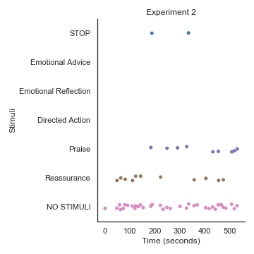
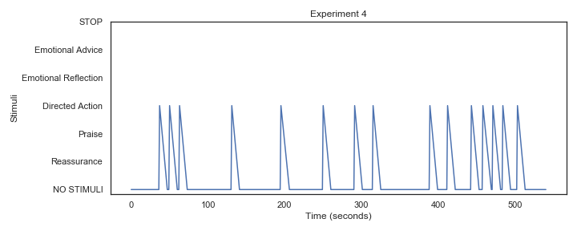
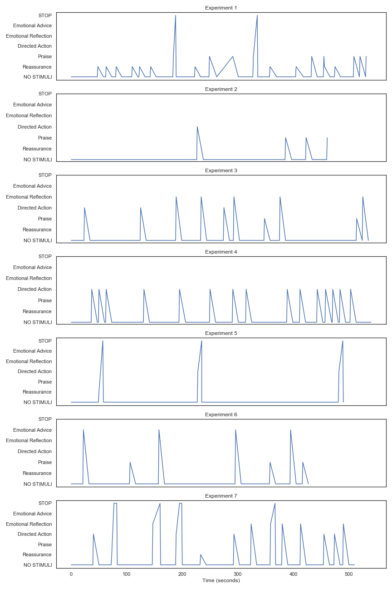
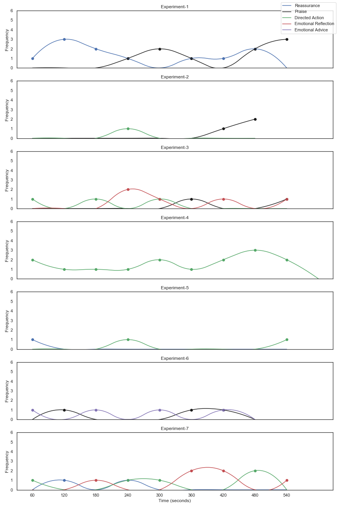

# Stimuli-based time series visualisation

This repository contains source code for visualizing stimuli (state) based time-series visualization.

**Data format:**  `timestamp`:time stamp, `type of stimuli`:stimuli or state

**Pre-Processing:** Each log files of experiments were pre-processed to normalize timestamp in terms of seconds passed from the start of the experiment.

### Visualization

There are two types of visualization are generate. Type-1 showing data in dots form and type-2 showing data in line plot.

**Type-1 plot**

**Type-2 plot**

**Type-2 plot for all experiments**

**Type-3 Plot**

